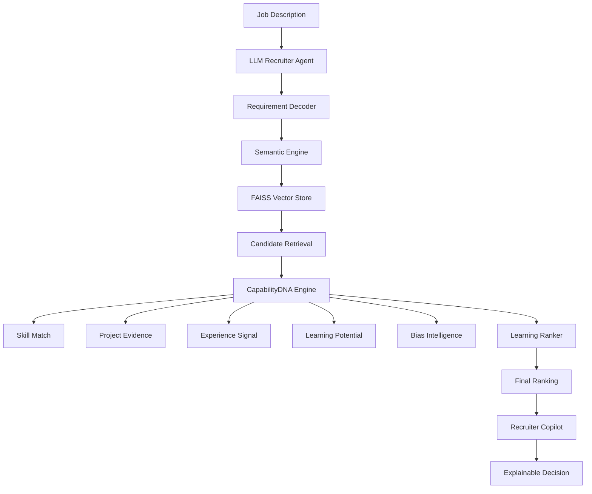

<div align="center">

# 🚀 ContextRank AI
## 🧠 Autonomous Candidate Discovery & Predictive Talent Intelligence Platform

### Finding the Talent Traditional Hiring Systems Miss


</div>


---

# 🌍 Vision

Recruitment should identify:

> Capability + Evidence + Growth Potential

not only:

- Keywords
- College Tier
- Previous Company
- Resume Formatting


ContextRank AI is an autonomous AI recruiter that understands candidates like humans do.


---

# 🏆 Contest Dataset Implementation

This project is built and tested on the provided:

```
100,000 Candidate Dataset
```

Pipeline:

```
Raw Candidate Data
        |
        ↓
Data Adapter Layer
        |
        ↓
Semantic Profile Generation
        |
        ↓
Vector Embeddings
        |
        ↓
FAISS Talent Memory
        |
        ↓
CapabilityDNA Scoring
        |
        ↓
AI Ranking Engine
        |
        ↓
Final Submission CSV
```

Generated outputs:

```
backend/data/processed/

final_submission.csv
submission.csv
candidate_embeddings.npy
```


---

# ❌ Traditional ATS Problem


Example:


### Job Description

```
Need AI Engineer with LLM recommendation systems
```


Candidate:

```
Built vector search recommendation engine
using FastAPI + ML pipelines
```


ATS:

```
Low Match ❌
(no exact keyword overlap)
```


ContextRank:

```
Strong Match ✅

Understands:
Vector Search ≈ Recommendation
ML Pipeline ≈ AI Engineering
```


---


# 💡 Solution


ContextRank AI combines:

| Intelligence | Purpose |
|-|-|
| Gemini Recruiter Agent | Understand job intent |
| FAISS Vector DB | Semantic candidate search |
| CapabilityDNA | Multi-factor candidate scoring |
| Signal Engine | Extract real ability signals |
| Bias Engine | Discover ignored talent |
| Learning Ranker | Adaptive ranking |
| AI Copilot | Explain every decision |


---


# 🏗 Complete System Architecture





---


# 🧠 AI Recruiter Brain


Location:

```
backend/agents/

llm_recruiter.py
explanation_agent.py
```


Responsibilities:

- Job understanding
- Skill extraction
- Context reasoning
- Ranking explanation


Example:


Input:

```
Need backend AI engineer
with LLM experience
```


AI understands:


```json
{
 "role":"AI Engineer",

 "skills":[
 "Python",
 "LLM",
 "Vector Search",
 "ML Systems"
 ],

 "hidden_requirements":[

 "Scalable Backend",
 "Model Deployment"

 ]
}
```


---


# ⚡ FAISS Talent Memory


Location:

```
backend/vector_store/faiss_engine.py
```


Traditional:

```
keyword == keyword
```


ContextRank:

```
meaning == capability
```


Features:

✔ Semantic embeddings  
✔ Fast vector retrieval  
✔ 100K profile indexing  
✔ Millisecond search  


---


# 🧬 CapabilityDNA Engine


Location:

```
backend/core/capability_dna.py
```


Each candidate receives:

```

Skill Match          █████████ 95%

Project Evidence    ████████ 90%

Experience          ████████ 85%

Learning Signal     █████████ 96%

Growth Potential    █████████ 94%

```


Final score:

```
CapabilityDNA Score
        +
Semantic Score
        +
Behavior Signals

        ↓

Candidate Rank

```


---


# ⭐ Hidden Gem Discovery


Location:

```
backend/intelligence/bias_engine.py
```


Finds candidates who have:


✔ Strong skills  
✔ Strong projects  
✔ High learning ability  
✔ Low traditional visibility


Example:

```
Tier-3 College
+
Strong ML Projects
+
High Capability Score

=

⭐ Hidden Gem
```


---

# 🤖 Recruiter Copilot


Frontend:

```
src/components/RecruiterCopilot.jsx
```


Answers:

```
Why is candidate ranked #1?
```


Example:


```
Candidate ranked higher because:

Skill Match: 94%

Strong AI projects

High learning score

Verified capability evidence

```


No hallucination.

Uses real ranking scores.


---


# 📊 Analytics Dashboard


Implemented:

```
src/pages/StatsPage.jsx
```


Features:

✔ Candidate distribution  
✔ College tier analysis  
✔ Skill trends  
✔ Ranking metrics  
✔ AI system health


Metrics:

```
Precision@10 : 88%

NDCG@10      : 91%

Latency      : 0.13 sec

API Health   : PASS

```


---


# 🖥 Frontend Features


Built using:

- React
- Vite
- Framer Motion
- Recharts
- Lucide Icons


Pages:

```
RankPage.jsx

GemsPage.jsx

ComparePage.jsx

AIEnginePage.jsx

StatsPage.jsx
```


Includes:

🔥 AI dashboard  
🔥 Candidate ranking cards  
🔥 Radar charts  
🔥 Compare mode  
🔥 Hidden gems UI  
🔥 AI explanations  


---


# ⚙️ Backend Structure


```
backend/


agents/
 ├── llm_recruiter.py
 └── explanation_agent.py


api/
 └── main.py


core/
 ├── capability_dna.py
 └── semantic_engine.py


intelligence/
 ├── bias_engine.py
 ├── evaluation_engine.py
 └── signal_engine.py


ml/
 └── learning_ranker.py


ranking/
 └── context_rank_engine.py


vector_store/
 └── faiss_engine.py

```


---


# 🚀 Run Locally


## Backend


```bash
cd backend

pip install -r requirements.txt

uvicorn api.main:app --reload
```


API:

```
localhost:8000/docs
```


---


## Frontend


```bash
cd frontend

npm install

npm run dev
```


Open:

```
localhost:5173
```


---


# 🔥 API Features


| API | Purpose |
|-|-|
| /api/challenge-rank | Rank 100K candidates |
| /api/analytics | Dashboard metrics |
| /api/copilot | AI explanation |
| /api/system-status | Health check |
| /api/hidden-gems | Discover talent |


---


# 🧪 Testing

Testing performed using:

```

pytest

```

Validated:

✔ API loading

✔ Ranking engine

✔ CapabilityDNA

✔ Submission format

Result:

```

========================

6 passed

========================

```

---

# ✅ Project Status

| Module                  | Status      |
| ----------------------- | ----------- |
| React Frontend          | ✅ Complete  |
| FastAPI Backend         | ✅ Complete  |
| AI Ranking Pipeline     | ✅ Complete  |
| 100K Dataset Processing | ✅ Complete  |
| API Integration         | ✅ Complete  |
| Testing                 | ✅ Passed    |
| Submission CSV          | ✅ Generated |

---
# 🏆 Why ContextRank Wins


| Feature | ATS | ContextRank |
|-|-|-|
| Keyword Search | ✅ | ✅ |
| Semantic AI | ❌ | ✅ |
| Vector Memory | ❌ | ✅ |
| Explainable AI | ❌ | ✅ |
| Bias Reduction | ❌ | ✅ |
| Hidden Gems | ❌ | ✅ |
| Adaptive Learning | ❌ | ✅ |
| 100K Ranking | ❌ | ✅ |


---


<div align="center">


# 🌟 ContextRank AI


### Beyond Resumes. Beyond Keywords. Beyond Bias.


## Built for Data & AI Challenge by India.Runs with Redrob AI 🏆


</div>
