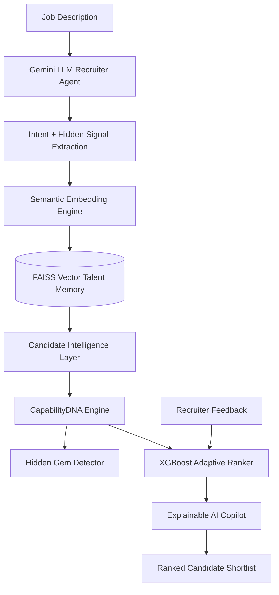

<div align="center">

# 🚀 ContextRank AI 
## 🧠 Autonomous Candidate Discovery & Predictive Talent Intelligence Platform

### Beyond Keywords. Beyond Resumes. Beyond Bias.


</div>


---

# 🌍 Vision

Recruitment should recognize **ability, not just keywords**.

Traditional hiring systems reject thousands of capable candidates because they depend on:

- Exact keyword matching
- College reputation
- Company brands
- Static resume filters


ContextRank AI acts like an intelligent recruiter:

> "Who has the strongest evidence and potential to succeed?"


---

# ❌ Problem With Existing ATS


Example:


```
Job:

Need scalable AI backend experience


Candidate:

Built FastAPI ML pipelines with vector search


Traditional ATS:

❌ Weak match (missing keywords)


ContextRank AI:

✅ Strong match (understands meaning)
```


---

# 💡 Our Solution


ContextRank AI combines multiple intelligence layers:


### 🧠 Gemini Recruiter Brain

Understands job intent.

Extracts:

- Required skills
- Hidden expectations
- Success signals


### 🚀 FAISS Talent Memory

Vector-based semantic search.

Finds:

- Similar experience
- Related skills
- Hidden matches


### 🧬 CapabilityDNA Engine

Creates candidate intelligence profile.


### ⭐ Hidden Gem Detector

Finds overlooked high-potential candidates.


### 📈 XGBoost Learning Ranker

Learns from recruiter decisions and improves ranking.


---


# 🏗 Complete AI Architecture





---

# 🔥 AI Engine Pipeline


```

               JOB DESCRIPTION

                       |
                       ▼

          🧠 Gemini Recruiter Brain

          Understands hidden needs


                       |
                       ▼

           🚀 FAISS Vector Search

           Semantic candidate retrieval


                       |
                       ▼


            🧬 CapabilityDNA


       Skills █████████ 94%

       Growth █████████ 96%

       Impact ████████ 90%


                       |
                       ▼


           📈 XGBoost Ranker


       Learns recruiter preference


                       |
                       ▼


            🏆 Final Ranking

```


---


# 🧠 LLM Job Understanding


Input:


```
Need AI Engineer with LLM and recommendation systems
```


AI Output:


```json
{
 "role":"AI Engineer",

 "skills":[
  "Python",
  "Machine Learning",
  "LLM"
 ],

 "hidden_expectations":[
  "Model Deployment",
  "AI System Design",
  "Scalability"
 ]
}

```


---


# 📈 Self Learning Ranker


Recruiter action:


```
👍 Select Candidate

👎 Reject Candidate
```


AI learns:


```
More weight:
+ Projects
+ Skills
+ Experience


Less weight:
- College bias
- Brand dependency
```


---

# ⭐ Hidden Gem Discovery


Old Hiring:


```
Tier 1 College
      +
Big Company

= Top Candidate

```


ContextRank:


```
Evidence
+
Projects
+
Growth Signals


= Top Candidate

```


---


# 🇮🇳 India Impact


Many talented engineers from smaller colleges never reach interviews.


Dataset:


```

Candidates: 1000+

Tier-3 Representation: 68%

Hidden Gems Found: 159+

Ranking Time: 0.13 sec

```


ContextRank promotes:


✔ Equal Opportunity  
✔ Skill Based Hiring  
✔ Bias Reduction  


---

# 🎨 AI Dashboard


Features:


```

🚀 ContextRank AI Console


🧠 Gemini Brain
Status: ACTIVE


🚀 FAISS Memory
1000+ profiles indexed


📈 Learning Ranker
Adaptive Intelligence


⭐ Hidden Gems


🏆 Candidate Ranking

```


---

# 🔥 API Endpoints


| API | Purpose |
|-|-|
| `/api/rank` | Candidate Ranking |
| `/api/analyze-job` | Gemini Job Understanding |
| `/api/feedback` | XGBoost Learning |
| `/api/hidden-gems` | Hidden Talent Discovery |
| `/api/system-status` | AI Health Check |


---

# 🛠 Technology Stack


## Frontend

- React
- Vite
- Framer Motion
- Lucide Icons
- Glassmorphism UI


## Backend

- Python
- FastAPI
- REST APIs


## Artificial Intelligence

- Gemini LLM
- FAISS Vector Search
- XGBoost Learning Ranker
- Semantic Embeddings


---

# 📂 Project Structure


```

ContextRank_AI


backend

├── api

│   └── main.py


├── agents

│   └── llm_recruiter.py


├── vector_store

│   └── faiss_engine.py


├── ml

│   └── learning_ranker.py


├── intelligence

│   └── capability_engine.py


frontend

├── src

│   ├── components

│   ├── pages

│   └── App.jsx


data

docs

results


```


---

# 🚀 Run Locally


## Backend


```bash
cd backend

python -m venv venv

source venv/Scripts/activate

pip install -r requirements.txt

python -m uvicorn api.main:app --reload

```


Swagger:


```
http://127.0.0.1:8000/docs
```


## Frontend


```bash
cd frontend

npm install

npm run dev

```


Open:


```
http://localhost:5173

```


---


# 🏆 Why ContextRank Wins


| Feature | ATS | ContextRank |
|-|-|-|
| Keyword Search | ✅ | ✅ |
| Understand Meaning | ❌ | ✅ |
| LLM Reasoning | ❌ | ✅ |
| Vector Search | ❌ | ✅ |
| Learns Feedback | ❌ | ✅ |
| Finds Hidden Talent | ❌ | ✅ |
| Explainable AI | ❌ | ✅ |
| Bias Reduction | ❌ | ✅ |


---


<div align="center">


# 🌟 ContextRank AI 


## Finding Talent The World Overlooks.


### Built for The Data & AI Challenge 🏆


</div>