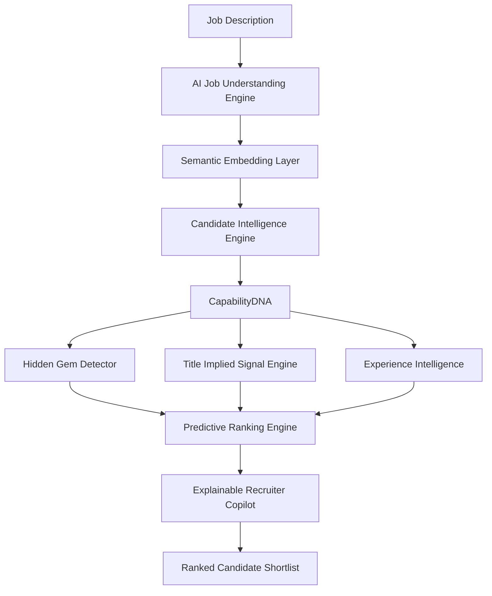

<div align="center">

# 🚀 ContextRank AI  
## 🧠 Intelligent Candidate Discovery & Predictive Talent Ranking Engine

### Beyond Keywords. Beyond Resumes. Discovering Talent Humans Miss.


</div>


---

# 🌍 Vision

Millions of capable candidates are rejected every year because hiring systems search for **keywords**, not **capability**.

Traditional ATS asks:

> "Does this resume contain the exact word?"

ContextRank asks:

> "Does this person have the ability, evidence, and potential to succeed?"


ContextRank is an AI-powered recruiter brain that converts massive talent pools into intelligent ranked shortlists.


---

# ❌ Problem

Recruiters face:

- Thousands of applications per role
- Keyword matching limitations
- Hidden talent loss
- College/company brand bias
- Lack of explainability


Example:

```
Job:
Need scalable backend experience

Candidate:
Built distributed FastAPI services

ATS:
❌ Weak Match

ContextRank:
✅ Strong engineering match
```

---

# 💡 Solution Overview


ContextRank combines:

✔ Semantic AI Understanding  
✔ Candidate Capability Modeling  
✔ Behavioral Signals  
✔ Hidden Gem Discovery  
✔ Explainable AI Ranking  


---

# 🧠 System Architecture




---

# ⚡ How ContextRank Works


## 1️⃣ Deep Job Understanding


Input:

```
Looking for ML Engineer experienced with recommendation systems
```

AI extracts:

```json
{
"core_role":"Machine Learning Engineer",

"explicit_skills":[
"ML",
"Python"
],

"hidden_signals":[
"data pipelines",
"experimentation",
"model deployment"
]
}
```

---

# 2️⃣ Candidate Intelligence Layer


Each candidate becomes a Capability Profile:


```
Candidate DNA


Technical Ability     █████████ 94%

Project Strength      ████████ 89%

Learning Signal       █████████ 96%

Career Potential      █████████ 95%

Role Alignment        ████████ 91%

```

---

# ⭐ Hidden Gem Discovery


Traditional hiring:

```
Tier-1 College
Big Company
= Higher Rank
```

ContextRank:

```
Evidence
Skill Growth
Projects
Learning Speed
= Higher Potential
```

---

## 🇮🇳 India Impact


A major challenge in India:

Many strong engineers come from Tier-2/Tier-3 colleges but lose opportunities due to filtering bias.


Dataset simulation:

```
1000 Candidates

≈68% Tier-3 representation

159 Hidden Gems discovered
```

ContextRank surfaces ability over background.


---

# 🤖 Recruiter AI Copilot


Recruiters can ask:

```
Why Candidate #1?
```


AI explains:

```
Selected because:

✓ Strong semantic match
✓ Verified project experience
✓ High growth indicators


Possible Risk:

Limited enterprise exposure

```

---

# 📊 Performance


Test Dataset:

```
Candidates Tested: 1000+

Ranking Speed: ~0.13 seconds

API Success: 9/9 endpoints passing

Output:
Top ranked candidate shortlist
```

---

# 🔥 API System


FastAPI Backend:


```
/api/rank

/api/system-status

/api/explain

/api/hidden-gems

/api/copilot

```


---

# 🏗 Technology Stack


## Backend

- Python
- FastAPI
- Machine Learning Ranking Engine
- Semantic Similarity Models


## AI Layer

- NLP Processing
- Embedding Based Matching
- Predictive Ranking
- Explainable AI


## Frontend

- React
- Tailwind CSS
- Interactive Dashboard


---

# 📂 Project Structure


```
ContextRank


backend/

├── api/

│   └── main.py


├── core/

│   └── ranking_engine.py


├── intelligence/

│   └── capability_model.py


├── agents/

│   └── recruiter_copilot.py


frontend/

├── src/

│

└── components/


datasets/

results/

docs/

```


---

# 🚀 Running Locally


## Backend

```bash
cd backend

python -m venv venv

source venv/Scripts/activate

pip install -r requirements.txt

python -m uvicorn api.main:app --reload
```


Backend:

```
http://127.0.0.1:8000/docs
```


---


## Frontend


```bash
cd frontend

npm install

npm run dev
```


Frontend:

```
http://localhost:5173
```


---

# 🏆 Why ContextRank is Different


| Feature | Traditional ATS | ContextRank |
|-|-|-|
| Keyword Search | ✅ | ✅ |
| Understand Meaning | ❌ | ✅ |
| Finds Hidden Talent | ❌ | ✅ |
| Explains Ranking | ❌ | ✅ |
| Uses Behavior Signals | ❌ | ✅ |
| Predicts Potential | ❌ | ✅ |
| Reduces Background Bias | ❌ | ✅ |


---

# 🎯 Final Output


Instead of:

```
Candidate matched 7 keywords
```


ContextRank gives:


```
Rank #1 Candidate

Match Score: 96%

Hiring Confidence: 94%

Reason:

✓ Relevant experience

✓ Strong project evidence

✓ High learning potential

```


---

<div align="center">

# 🌟 ContextRank AI

## Finding the talent the world overlooks.

</div>