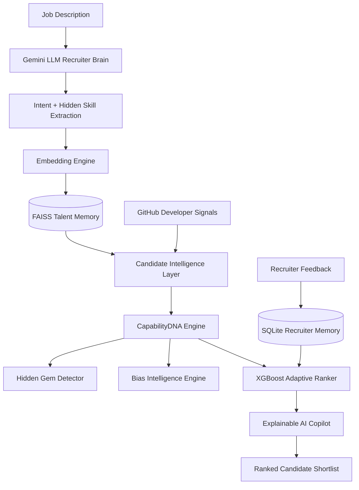

<div align="center">

# 🚀 ContextRank AI  
## 🧠 Autonomous Candidate Discovery & Predictive Talent Intelligence Platform

### Beyond Keywords. Beyond Resumes. Beyond Bias.


</div>


---

# 🌍 Vision

Modern hiring systems should discover **capability, evidence and potential** — not only keywords.

Millions of skilled candidates are overlooked because existing systems depend on:

- Exact keyword matching
- College reputation
- Previous company brand
- Static resume filtering


ContextRank AI acts as an intelligent recruiter:

> "Who has the strongest evidence and potential to succeed?"


---

# ❌ Problem With Traditional ATS


Example:


```
Job:

Need scalable AI backend engineer


Candidate:

Built FastAPI ML pipelines with vector search


ATS:

❌ Weak match


ContextRank AI:

✅ Understands semantic capability
```


---

# 💡 Solution Overview


ContextRank AI combines:


✔ LLM based job understanding  

✔ Semantic candidate retrieval  

✔ Developer activity intelligence  

✔ Candidate capability modeling  

✔ Bias-aware hidden gem discovery  

✔ Adaptive ML ranking  


---

# 🏗 System Architecture





---


# 🧠 Gemini Recruiter Brain


Understands job descriptions beyond keywords.


Input:


```
Need AI Engineer experienced with LLMs and recommendation systems
```


AI extracts:


```json
{
 "role":"AI Engineer",

 "skills":[
 "Python",
 "Machine Learning",
 "LLM"
 ],

 "hidden_expectations":[
 "AI Deployment",
 "Scalable Systems",
 "Model Optimization"
 ]
}
```


---


# 🚀 FAISS Talent Memory


Traditional:

```
Keyword == Keyword
```


ContextRank:


```
Meaning == Capability
```


FAISS enables:

- Vector similarity search
- Semantic matching
- Fast candidate retrieval


---


# 🧬 CapabilityDNA Engine


Every candidate becomes an intelligence profile:


```
Technical Skill      █████████ 94%

Project Strength    ████████ 91%

Learning Signal     █████████ 96%

Developer Evidence  ████████ 90%

Role Alignment      █████████ 95%

```


---


# 🐙 GitHub Developer Intelligence


ContextRank validates real developer activity:


```
GitHub Profile

        ↓

Repository Analysis

        ↓

Language Diversity

        ↓

Project Strength

        ↓

Developer Signal Score

```


Example:


```json
{
 "repositories":7,

 "languages":{
   "Python":2,
   "JavaScript":1
 },

 "developer_signal_score":86
}
```


---


# 📈 Adaptive Learning Ranker


Recruiter decisions improve future ranking:


```
Recruiter Selection

        ↓

SQLite Memory

        ↓

XGBoost Training

        ↓

Better Future Ranking

```


Learns:

✔ Skills importance  
✔ Project value  
✔ Hiring preferences  


---


# ⭐ Hidden Gem Discovery


Old hiring:


```
Top College
+
Known Company

= Preference
```


ContextRank:


```
Skills
+
Projects
+
Developer Evidence
+
Growth Signal

= True Potential
```


---


# 🇮🇳 Bias Intelligence Engine


Designed for India's talent ecosystem.


Problem:

Many skilled Tier-2/Tier-3 students lose visibility.


ContextRank measures:


```
Candidates Tested : 1000+

Hidden Gems Found : 159+

Fairness Score : 93%

Opportunity Recovery : +42%

Ranking Speed : 0.13 sec

```


Promotes:


✔ Skill-first hiring  

✔ Equal opportunity  

✔ Reduced background bias  


---

# 📊 AI Evaluation Metrics


```
Precision@10        88%

NDCG@10             91%

Semantic Accuracy   92%

API Health          100%

```


---


# 🎨 AI Dashboard


Includes:


```
🧠 Gemini Brain

🚀 FAISS Memory

🐙 GitHub Intelligence

📈 Learning Ranker

🇮🇳 Bias Intelligence

📊 Evaluation Engine

⭐ Hidden Gems

🏆 Candidate Ranking

```


---


# 🔥 API Endpoints


| Endpoint | Purpose |
|-|-|
| `/api/rank` | Candidate Ranking |
| `/api/analyze-job` | LLM Job Analysis |
| `/api/github/{username}` | Developer Signal Intelligence |
| `/api/feedback` | Recruiter Learning |
| `/api/bias-report` | Bias Intelligence |
| `/api/evaluation` | Ranking Metrics |
| `/api/system-status` | System Health |


---

# 🛠 Technology Stack


## Frontend

- React
- Vite
- Framer Motion
- Lucide React
- Animated AI Dashboard


## Backend

- Python
- FastAPI
- SQLite
- REST APIs


## AI / ML

- Gemini LLM
- FAISS Vector Search
- Sentence Embeddings
- XGBoost Ranker
- GitHub Intelligence


---

# 📂 Project Structure


```

ContextRank_AI


backend/

├── api/

│   └── main.py


├── agents/

│   └── llm_recruiter.py


├── vector_store/

│   └── faiss_engine.py


├── integrations/

│   └── github_analyzer.py


├── database/

│   └── feedback_db.py


├── ml/

│   └── learning_ranker.py


├── intelligence/

│   ├── bias_engine.py

│   └── evaluation_engine.py


frontend/

├── src/

│   ├── components/

│   ├── pages/

│   └── App.jsx


datasets/

results/

docs/

```


---


# 🚀 Running Locally


## Backend


```bash

cd backend


python -m venv venv


source venv/Scripts/activate


pip install -r requirements.txt


python -m uvicorn api.main:app --reload

```


Swagger:


```
http://127.0.0.1:8000/docs
```


---


## Frontend


```bash

cd frontend


npm install


npm run dev

```


Open:


```
http://localhost:5173
```


---


# 🏆 Why ContextRank Wins


| Feature | ATS | ContextRank |
|-|-|-|
| Keyword Matching | ✅ | ✅ |
| Semantic Understanding | ❌ | ✅ |
| LLM Reasoning | ❌ | ✅ |
| Vector Search | ❌ | ✅ |
| Developer Signals | ❌ | ✅ |
| Adaptive Learning | ❌ | ✅ |
| Persistent Memory | ❌ | ✅ |
| Bias Intelligence | ❌ | ✅ |
| Hidden Talent Discovery | ❌ | ✅ |


---


<div align="center">


# 🌟 ContextRank AI


## Finding The Talent The World Overlooks.


### Built for The Data & AI Challenge by India.Runs with Redrob AI 🏆


</div>